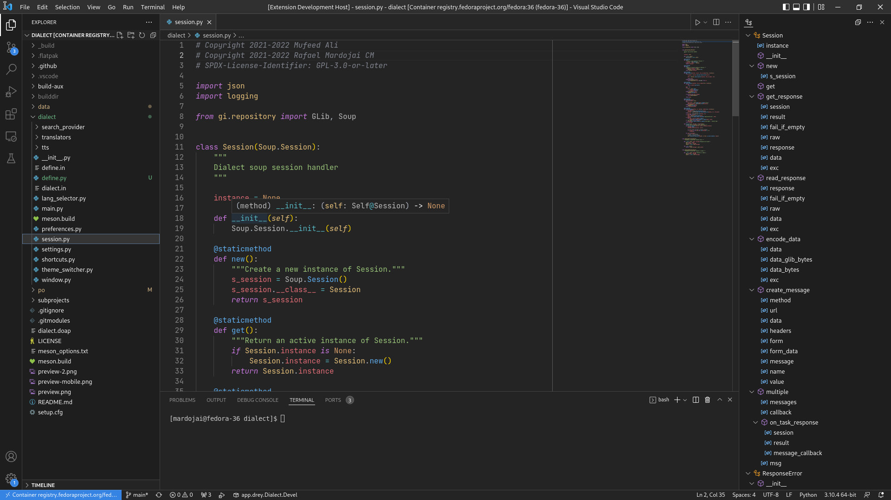

# VSCode GNOME theme

 

A GNOME color theme for VSCode

Colors based in [OneDark-Pro by Binaryify](https://github.com/Binaryify/OneDark-Pro) for syntax and Adwaita for UI.

Install it from the [VSCode Marketplace](https://marketplace.visualstudio.com/items?itemName=rafaelmardojai.vscode-gnome-theme) or the [OpenVSX Registry](https://open-vsx.org/extension/rafaelmardojai/vscode-gnome-theme).

## Contribute
I don't have to much time to actively maintain this theme, so if you can contribute, it will be very welcome :P.
